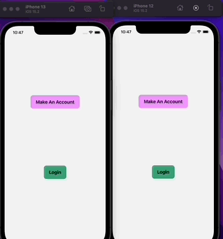
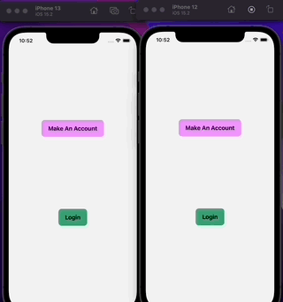
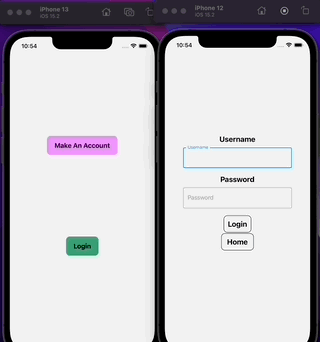
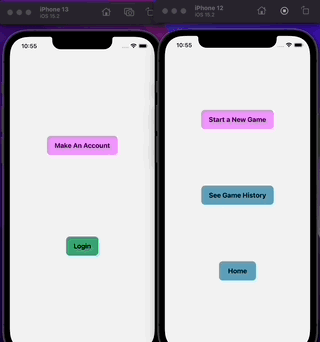
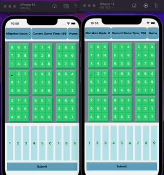

# 2P-Sudoku

2P-Sudoku is a competitive Sudoku mobile application designed to allow players to compete against similarly rated opponents. 

### Description 
> 2P-Sudoku is a work in progress designed to simulate a competitive game of Sudoku. Upon logging in, users will be assigned a base rating of 1000 which will fluctuate according to games played against others (see Elo Rating System for further reading). This application currently requires you to create an account with a valid email, username, and password. Upon logging in, you have a chance to either join the lobby to start a new game and in the future will be able to view your game history. Once an opponent is found, you will both be given the same board with the objective of completing before your opponent, but be careful because upon submittal every mistake you make will add to your timer! Once you have submitted the correct solution, you will be told whether you won or lost (and in the future will have your score displayed). 

## Features

### Sign Up (Valid Inputs)
 

### Sign Up (Invalid Inputs)
 

### Login

### Start a New Game

### Submit

## Further Reading
https://medium.com/purple-theory/what-is-elo-rating-c4eb7a9061e0

https://www.geeksforgeeks.org/elo-rating-algorithm/

## Technologies
- React-Native
- Babel
- Socket.IO-Client
- Axios
- Material-UI
- React-Native Navigation

## Author Info
- LinkedIn:  https://www.linkedin.com/in/justin-tat-30a994238/

